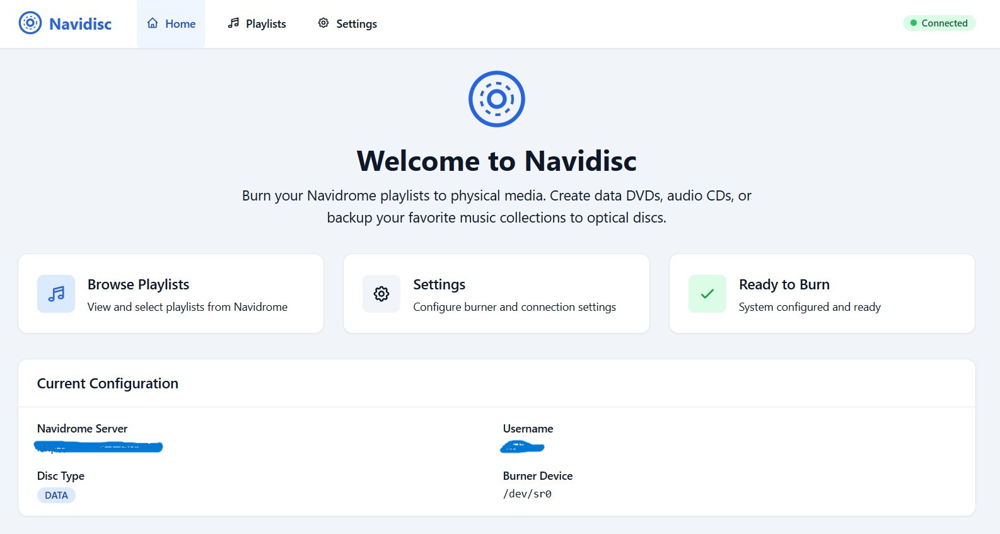
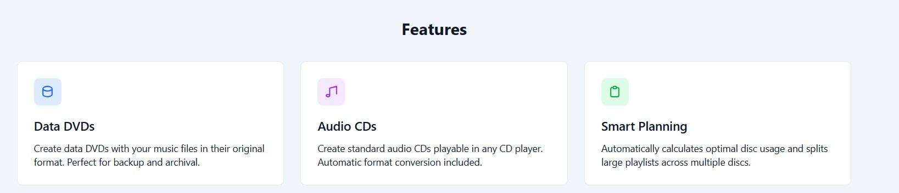

# Navidisc

**Convert Navidrome playlists to physical CDs with ease.**

© 2026 Will Bates. All rights reserved.

Navidisc is a Linux-based automation tool that takes your Navidrome (Subsonic) playlists and burns them to one or more physical CDs. It handles playlist resolution, file staging, disc capacity planning, and multi-disc workflows automatically.


## Features

- 🎵 **Subsonic API Integration** - Connect directly to Navidrome or any Subsonic-compatible server
- 💿 **Smart Disc Planning** - Automatically splits playlists across multiple discs while preserving track order
- 📀 **Data & Audio CDs** - Support for both data CDs (700MB) and audio CDs (80 min)
- 🔄 **Multi-Disc Workflow** - Guided prompts for disc insertion during multi-disc burns
- ⚡ **Efficient Staging** - Uses hardlinks when possible to minimize disk space
- 🖥️ **Interactive & Headless** - Works interactively or in automated/scripted environments
- 🔧 **Configurable** - YAML-based configuration with sensible defaults
- 🎚️ **MP3 Conversion** - Convert FLAC, WAV, and other formats to MP3 with selectable quality (Best, High, Medium, Small) using ffmpeg
- 🚀 **Intelligent Burn Speed & Media Type** - Choose disc type (CD-R, DVD±R, BD-R, etc.) and let Navidisc auto-calculate the safest or fastest burn speed based on your drive and media

## Requirements

### System
- Linux with optical drive support (kernel with CD/DVD writing capability)
- Tested on: Debian/Ubuntu, Arch, Fedora

### System Tools
- `growisofs` - For data CDs (from `dvd+rw-tools` package)
- `cdrecord` or `cdrdao` - For audio CDs (optional)
- `eject` - For disc ejection
- `lsblk` or `udevadm` - For drive detection

### Python
- Python 3.11 or later

## Installation

### From Source (Development)

```bash
# Clone the repository
git clone https://github.com/navidisc/navidisc.git
cd navidisc

# Create a virtual environment
python -m venv .venv
source .venv/bin/activate

# Install in development mode
pip install -e ".[dev]"
```

### System Dependencies (Ubuntu/Debian)

```bash
sudo apt install dvd+rw-tools cdrdao wodim eject
```

### System Dependencies (Arch)

```bash
sudo pacman -S dvd+rw-tools cdrdao cdrtools eject
```

### System Dependencies (Fedora)

```bash
sudo dnf install dvd+rw-tools cdrdao wodim eject
```

## Quick Start

### 1. Create Configuration

```bash
# Create config directory
mkdir -p ~/.config/navidisc

# Create configuration file
cat > ~/.config/navidisc/config.yaml << 'EOF'
navidrome:
  url: http://localhost:4533
  username: your_username
  password: your_password

burning:
  device: /dev/sr0
  disc_type: data
  disc_size_mb: 700

media:
  staging_dir: /tmp/navidisc
  download_mode: download-if-missing
EOF
```

### 2. Plan a Burn (Dry Run)

```bash
# See how a playlist would be split across discs
navidisc plan playlist "Road Trip" --dry-run
```

### 3. Burn a Playlist

```bash
# Burn a playlist by name
navidisc burn playlist "Road Trip"

# Burn by playlist ID
navidisc burn playlist --id abc123

# Burn as audio CD
navidisc burn playlist "Road Trip" --disc-type audio
```

## Web Interface

Navidisc includes a modern web-based GUI for a more visual experience.

### Start the Web Server

```bash
# Install web dependencies
pip install navidisc[web]

# Start the web interface (localhost only)
navidisc web

# Or specify host and port
navidisc web --host 0.0.0.0 --port 8080
```

Then open `http://localhost:8080` in your browser.

### Network Access (Access from Another Machine)

To access the web interface from another device on your network (e.g., a laptop, phone, or another computer):

#### 1. Start with network binding

```bash
# Bind to all network interfaces (required for external access)
navidisc web --host 0.0.0.0 --port 8080
```

The `--host 0.0.0.0` flag is essential - by default, the server only accepts connections from localhost (`127.0.0.1`).

#### 2. Find your host machine's IP address

**Linux:**
```bash
ip addr show | grep "inet "
# or
hostname -I
```

**Windows:**
```powershell
ipconfig
# Look for "IPv4 Address" (e.g., 192.168.1.100)
```

**macOS:**
```bash
ipconfig getifaddr en0
```

#### 3. Access from the other device

Open a browser on the other device and navigate to:
```
http://<host-ip>:8080
```

For example: `http://192.168.1.100:8080`

#### Firewall Configuration

If you cannot connect, you may need to allow the port through your firewall:

**Linux (UFW):**
```bash
sudo ufw allow 8080/tcp
```

**Windows:**
```powershell
# Run as Administrator
New-NetFirewallRule -DisplayName "Navidisc Web" -Direction Inbound -Port 8080 -Protocol TCP -Action Allow
```

### Web Interface Features

- 📋 **Browse Playlists** - View all playlists from your Navidrome server
- 💿 **Browse Albums** - View and burn albums directly from your library
- 📊 **Plan Visualization** - See how tracks will be split across discs
- 🔥 **Burn Workflow** - Real-time progress during burns
- ⚙️ **Settings UI** - Configure Navidrome connection and burn options
- 🌗 **Dark Mode** - Automatic dark mode support
- 📱 **Responsive** - Works on desktop and mobile browsers

### Screenshots

#### Home Page
The main dashboard showing quick access to playlists, settings, and current configuration status.



#### Features Overview
Highlights the key features of Navidisc including Data DVDs, Audio CDs, and Smart Planning capabilities.



#### Playlists Browser
Browse all your Navidrome playlists with track counts and duration. Click on any playlist to view details or start burning.


#### Settings - Connection
Configure your Navidrome server connection with URL, username, and password. Test the connection before saving.


#### Settings - Burning Options
Configure disc type, device path, and disc size for your burning preferences.


#### Burn Workflow - Plan
Review the burn plan showing how tracks will be distributed across discs with utilization percentages.


#### Burn Workflow - Progress
Real-time progress display during the burn process with activity log and status updates.


#### Burn Workflow - Complete
Confirmation screen showing successful completion of the burn operation.


## CLI Reference

### Commands

```bash
navidisc burn playlist <name|--id ID>    # Burn a playlist to disc(s)
navidisc plan playlist <name|--id ID>    # Plan without burning
navidisc list playlists                  # List available playlists
navidisc config show                     # Show current configuration
navidisc config init                     # Create example configuration
```

### Global Options

| Option | Description |
|--------|-------------|
| `--config FILE` | Use alternate config file |
| `--dry-run` | Plan only, don't burn |
| `--headless` | Non-interactive mode |
| `--force` | Skip confirmation prompts |
| `--verbose` / `-v` | Increase output verbosity |


### Burn Options

| Option | Description |
|--------|-------------|
| `--disc-type TYPE` | `data` or `audio` |
| `--device PATH` | Optical drive device |
| `--media-type TYPE` | Specify media type (e.g. `cd-r-52x`, `dvd-r-16x`, `bd-r-16x`, or `auto`) |
| `--write-speed PRESET` | Burn speed: `auto` (recommended), `max`, `safe`, or `custom` |
| `--custom-speed X` | Custom speed multiplier (e.g. `16` for 16x) |
| `--conversion-quality Q` | Audio conversion quality: `best`, `high`, `medium`, `small`, or `disabled` |
| `--no-verify` | Skip post-burn verification |
| `--no-eject` | Don't eject disc after burn |
| `--output-plan FILE` | Save burn plan to JSON |


## Configuration

Navidisc uses YAML configuration stored at `~/.config/navidisc/config.yaml`.

### Full Configuration Reference

```yaml
navidrome:
  url: http://localhost:4533      # Navidrome server URL
  username: user                  # API username
  password: pass                  # API password

burning:
  device: /dev/sr0                # Optical drive path
  disc_type: data                 # data or audio
  disc_size_mb: 700               # Data disc capacity (MB)
  audio_disc_minutes: 80          # Audio disc capacity (minutes)
  media_type: auto                # auto, cd-r-52x, dvd-r-16x, bd-r-16x, etc.
  write_speed: auto               # auto, max, safe, custom
  custom_speed: null              # integer (e.g. 16 for 16x), only if write_speed: custom
  verify_after_burn: true         # Verify disc after burning
  eject_after_burn: true          # Eject disc when done

media:
  staging_dir: /tmp/navidisc      # Temp directory for staging
  download_mode: download-if-missing  # local-only, download-if-missing, download-always
  use_hardlinks: true             # Use hardlinks to save space
  normalize_filenames: true       # Clean filenames for disc
  include_track_numbers: true     # Prefix with 01, 02, etc.
  conversion_quality: disabled    # best, high, medium, small, or disabled

logging:
  level: INFO                     # DEBUG, INFO, WARNING, ERROR
  format: text                    # text or json
  file: null                      # Optional log file path
```

## Architecture

Navidisc follows a modular, state-machine-driven architecture:

```
┌────────────┐
│   CLI/UI   │  ← User interaction, progress display
└─────┬──────┘
      │
┌─────▼──────┐
│Orchestrator│  ← State machine coordinating workflow
└─────┬──────┘
      │
 ┌────▼─────┐   ┌───────────┐   ┌──────────┐
 │ Subsonic │   │ Disc Plan │   │  Burner  │
 │  Client  │   │  Engine   │   │  Adapter │
 └────┬─────┘   └────┬──────┘   └────┬─────┘
      │              │               │
 ┌────▼─────┐   ┌────▼─────┐   ┌─────▼─────┐
 │ Media    │   │ Staging  │   │ System CD │
 │ Resolver │   │ Manager  │   │ Utilities │
 └──────────┘   └──────────┘   └───────────┘
```

### Modules

| Module | Description |
|--------|-------------|
| `navidisc.api` | Subsonic API client for Navidrome |
| `navidisc.media` | Track resolution and downloading |
| `navidisc.planner` | Disc capacity planning |
| `navidisc.staging` | File staging and preparation |
| `navidisc.burner` | Disc burning abstraction |
| `navidisc.core` | Orchestrator state machine |
| `navidisc.ui` | CLI and user interaction |
| `navidisc.config` | Configuration management |
| `navidisc.models` | Shared data models |

## Development

### Setup

```bash
# Clone and install in dev mode
git clone https://github.com/navidisc/navidisc.git
cd navidisc
python -m venv .venv
source .venv/bin/activate
pip install -e ".[dev]"
```

### Running Tests

```bash
pytest
pytest --cov=navidisc  # With coverage
```

### Code Quality

```bash
ruff check .           # Linting
ruff format .          # Formatting
mypy src/navidisc      # Type checking
```

### Project Structure

```
navidisc/
├── docs/
│   └── spec.md            # Detailed specification
├── src/
│   └── navidisc/
│       ├── __init__.py
│       ├── api/           # Subsonic client
│       ├── burner/        # Disc burning
│       ├── cli.py         # CLI entry point
│       ├── config.py      # Configuration
│       ├── core/          # Orchestrator
│       ├── media/         # Media handling
│       ├── models.py      # Data models
│       ├── planner/       # Disc planning
│       ├── staging/       # File staging
│       └── ui/            # User interface
├── tests/
├── pyproject.toml
└── README.md
```

## Workflow States

The orchestrator manages these states:

| State | Description |
|-------|-------------|
| `INIT` | Initial state |
| `AUTHENTICATED` | Connected to Navidrome |
| `PLAYLIST_RESOLVED` | Tracks fetched and resolved |
| `PLANNED` | Disc plan created |
| `STAGING_DISC` | Staging files for current disc |
| `WAIT_FOR_DISC` | Waiting for user to insert disc |
| `BURNING_DISC` | Burning in progress |
| `VERIFYING` | Verifying burned disc |
| `COMPLETE` | All discs burned successfully |
| `ERROR` | Error occurred (see logs) |


## File Conversion

Navidisc can automatically convert FLAC, WAV, and other lossless formats to MP3 for burning. You can select the conversion quality in the web UI or CLI:

- **Best**: 320kbps CBR (highest quality)
- **High**: 256kbps CBR
- **Medium**: 192kbps CBR (good balance)
- **Small**: 128kbps CBR (smallest size)
- **Disabled**: No conversion (original files used)

Conversion uses ffmpeg and preserves metadata. Conversion is performed before staging and burning.

## Burn Speed & Media Type

Navidisc lets you select the disc media type (CD-R, DVD±R, BD-R, etc.) and burn speed preset:

- **Media Type**: Choose from CD-R 52x, DVD-R 16x, BD-R 16x, etc., or use `auto` to detect automatically.
- **Write Speed**: Choose `auto` (recommended, ~70% of max), `max` (fastest), `safe` (50% of max), or `custom` (enter your own speed multiplier).

Navidisc will detect your drive's capabilities and the inserted media, and will recommend the safest or fastest speed accordingly. This helps prevent burn errors and ensures compatibility.

## Troubleshooting

### Permission Denied on /dev/sr0

```bash
# Add user to cdrom group
sudo usermod -aG cdrom $USER
# Log out and back in
```

### Drive Not Detected

```bash
# Check for optical drive
lsblk | grep sr
# Or
ls -la /dev/sr*
```

### Disc Capacity Errors

- Ensure correct disc type is selected
- Check `disc_size_mb` in config matches your media
- For audio CDs, check `audio_disc_minutes`

## License

This project is licensed under the GNU General Public License v3.0 - see the [LICENSE](LICENSE) file for details.

## Acknowledgments

- [Navidrome](https://www.navidrome.org/) - The music server that inspired this project
- [Subsonic API](http://www.subsonic.org/pages/api.jsp) - The API specification used for integration

---

**Note:** This project is in active development. Features and APIs may change.
